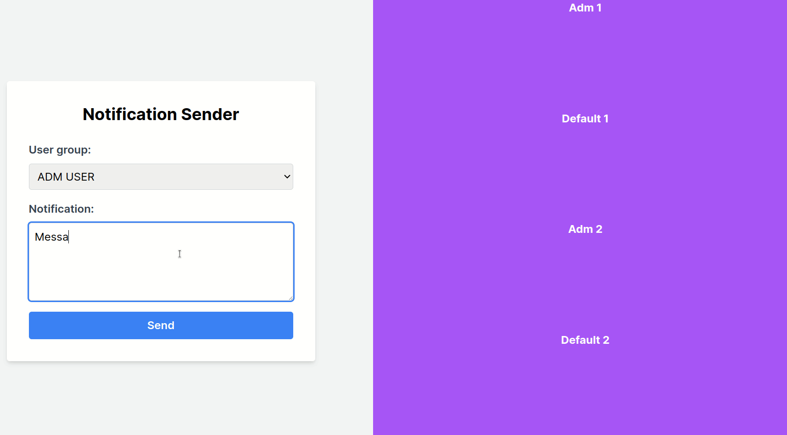

<h1> Using App </h1>

<h1> Overview </h1>

The system has a frontend in React/Next.js that sends messages to the producer via POST. 
  The producer, implemented with Spring Boot and Spring Kafka, publishes these messages to Kafka topics (notification_adm and notification_default). 
  The consumer, also with Spring Boot and Spring Kafka, consumes messages from these topics and sends them to the frontend via WebSocket to notify the user in real time. 
  Kafka was configured with Docker Compose, and the topics were created using Kafka commands.

<h1> Technologies used in the Frontend </h1>
<ul>
  <li>React/Next.js</li>
  <li>TypeScript</li>
  <li>Stompjs</li>
  <li>Sockjs-client</li>
</ul>

<h1> Technologies used in the Producer </h1>
<ul>
  <li>Spring Boot</li>
  <li>Spring Kafka</li>
</ul>

<h1> Technologies used in the Consumer </h1>
<ul>
  <li>Spring Boot</li>
  <li>Spring Kafka</li>
</ul>
